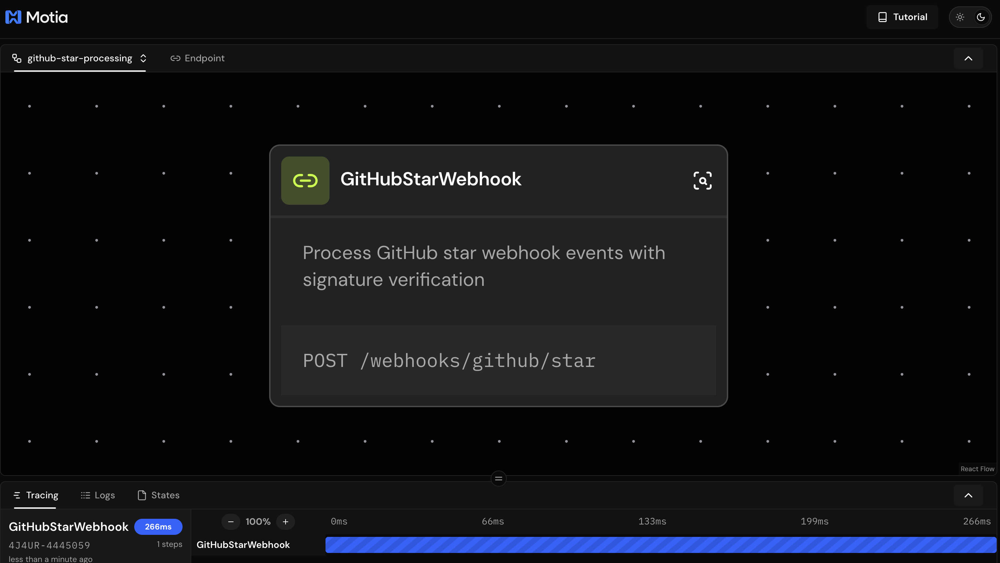

# ⭐ Live GitHub Stars Counter


A **real-time GitHub stars counter** built with [Motia](https://motia.dev) - showcasing how incredibly simple it is to build production-ready, real-time applications with just a few lines of code.


🎯 **Live in Action:** This exact counter powers the live star count on the [Motia website](https://motia.dev) - updating in real-time as developers star the repository!

## 🚀 Built with Motia in Minutes, Not Hours

This entire real-time application was built using just **2 simple steps**:

- **`01-github-webhook.step.ts`** - Secure webhook endpoint that receives GitHub star events
- **`00-repository-stars.stream.ts`** - Real-time data stream for live updates

That's it! No complex infrastructure, no boilerplate, no headaches. Just pure business logic.

## ✨ What Makes This Special

### 🔄 **Real-Time Updates**
- Stars update instantly across all connected clients
- Built-in streaming with automatic state management
- No WebSocket complexity or manual connection handling

### 🔐 **Production-Ready Security**  
- Automatic GitHub webhook signature verification
- Request validation with TypeScript + Zod schemas
- Error handling and logging

### 🎯 **Type-Safe Development**
- Full TypeScript support with auto-generated types
- API schema validation for requests and responses
- Zero runtime surprises

### ⚡ **One-Click Deployment**
- Deploy instantly to [Motia Cloud](https://motia.cloud)
- Built-in monitoring, scaling, and observability
- No DevOps configuration required

## 🏗️ How It Works

```typescript
// 1. Define your data structure
const RepositoryStarsSchema = z.object({
  stars: z.number(),
  name: z.string(),
  fullName: z.string(),
  organization: z.string(),
  lastUpdated: z.string(),
})

// 2. Create a real-time stream
export const config: StreamConfig = {
  name: 'stars',
  schema: RepositoryStarsSchema,
  baseConfig: { storageType: 'default' },
}

// 3. Handle webhook events
export const handler: Handlers['GitHubStarWebhook'] = async (req, { streams }) => {
  await streams.stars.set(organization, repository, starData)
  // Real-time updates sent automatically! 🎉
}
```

## 🚀 Quick Start

1. **Clone and Install**
   ```bash
   git clone https://github.com/MotiaDev/github-stars-counter.git
   cd github-stars-counter
   npm install
   ```

2. **Configure GitHub Webhook** (Optional)
   ```bash
   # Set up your webhook secret for security
   export GITHUB_WEBHOOK_SECRET=your-secret-here
   ```

3. **Start Development**
   ```bash
   npm run dev
   ```

4. **Deploy to Production**
   
   **Option 1: CLI Deployment**
   ```bash
   # Deploy with version and API key
   motia cloud deploy --api-key your-api-key --version-name 1.0.0
   
   # Deploy with environment variables
   motia cloud deploy --api-key your-api-key \
     --version-name 1.0.0 \
     --env-file .env.production \
     --environment-id your-env-id
   ```
   
   **Option 2: One-Click Web Deployment**
   1. Ensure your local project is running (`npm run dev`)
   2. Go to [Motia Cloud -> Import from Workbench](https://motia.cloud)
   3. Select your local project port
   4. Choose project and environment name
   5. Upload environment variables (optional)
   6. Click **Deploy** and watch the magic happen! ✨

## 🌐 Live Integration

This counter is actively running on the Motia website, demonstrating real-world production usage. Every star on the [Motia repository](https://github.com/MotiaDev/motia) triggers this webhook and updates the live counter instantly.

**See it in action on:** [Motia website](https://motia.dev)

## 🎯 Perfect for Learning

This project demonstrates core Motia concepts:

- **API Steps**: HTTP endpoints with automatic validation
- **Streams**: Real-time data synchronization  
- **State Management**: Persistent, scalable storage
- **Security**: Production-ready webhook verification
- **Type Safety**: End-to-end TypeScript integration

## 🔗 Learn More

- [Motia Documentation](https://motia.dev/docs)
- [Motia GitHub](https://github.com/MotiaDev/motia) ⭐
- [Deploy on Motia Cloud](https://motia.cloud)

---

**Built with ❤️ by the Motia Open Source community to showcase the power of unified backend development.**
